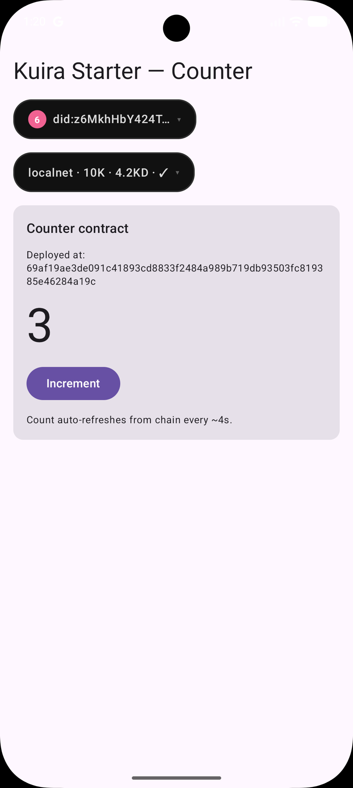

# Kuira Starter — Android

Minimum reproducible Kuira Android dApp. Sigil identity + embedded
wallet + a counter Compact contract — clone, set your `applicationId`
and `rpId`, host `assetlinks.json`, hit Run.

[](https://github.com/kuiralabs/kuira-starter-android/actions/workflows/build.yml)

This repository is also a GitHub template — click **Use this template**
on the repo page to spin up your own dApp without forking.

<p align="center">
  
</p>

---

## What this gives you

- **Identity + Wallet** — the SDK's `PanelBar` in floating mode drops two
  draggable chips over your content: a **sigil** chip (one biometric forges a
  passkey-PRF DID + wallet seed) and a **wallet** chip (NIGHT + DUST balance,
  receive-QR, dust registration, the network picker, and settings). Tap a chip to
  expand its sheet; drag it to dock at a screen edge.
- **Contract** — a 6-line counter in Compact (`contract/src/counter.compact`).
  Deploy on first run, increment with a single circuit call, and read state
  **reactively** via `MidnightContract.observeLedger()` — the count updates on
  each on-chain change, no polling. Deploy a fresh counter or disconnect from the
  card; switch the wallet chip's network and the counter follows it. Compiled
  artifacts are committed so the app builds out-of-box.

The whole demo is intentionally small (~700 LOC Kotlin code + ~6 lines
Compact, plus inline comments) so you can read every file in a single
sitting.

---

## Quick start

```bash
git clone https://github.com/kuiralabs/kuira-starter-android.git my-dapp
cd my-dapp
./gradlew :app:assembleDebug                # 5 to 7 minutes on a cold cache
```

Open in Android Studio. To actually run on a device, complete the four
**Before you run** items below.

---

## Before you run

The starter ships with four prep steps that you MUST complete before
the Sigil-forge path will succeed on a device. The first three are
single-string edits; the fourth is a terminal command:

| What | Where | Currently |
|---|---|---|
| `applicationId` + `namespace` | `app/build.gradle.kts` | `com.kuiralabs.starter.counter` |
| `PASSKEY_RP_ID` | `app/src/main/java/com/kuiralabs/starter/counter/di/PasskeyConfigModule.kt` | `"REPLACE_ME_WITH_YOUR_DOMAIN.example"` |
| `assetlinks.json` | hosted at `https://<your rpId>/.well-known/assetlinks.json` | not hosted |
| Wallet funding (localnet) | terminal — `mn` CLI | manual step, see below |

The `assetlinks.json` content must declare your app's signing
fingerprint. Full walkthrough — including release-keystore generation,
multi-fingerprint setup, and hosting on GitHub Pages / Vercel /
Cloudflare: [Bind your app to a passkey
domain](https://kuiralabs.github.io/kuira-sdk-android/recipes/bind-your-app-to-a-passkey-domain/).

---

## Funding the embedded wallet

The Sigil-forge gives you a brand-new wallet with zero NIGHT and zero
DUST. Compact contracts need DUST to pay tx fees, and the SDK won't
deploy until both are present.

**On localnet (`MidnightNetwork.UNDEPLOYED`):**

> **Node version matters.** This starter is tested against
> **`midnight-node:0.22.5`** — the `mn localnet` default — which ships
> on-chain Compact runtime **0.16.0**, the runtime the bundled `counter`
> contract is compiled for. On an older node (`≤ 0.22.3`, runtime
> `0.15.0`), **Deploy counter** fails with a runtime-version mismatch.
> Stick with the default (`0.22.5`) and you're fine.

1. Open the app, tap **Forge sigil** in the panel.
2. After forge, copy the wallet address from `WalletStatusPanel`.
3. In a terminal, airdrop NIGHT to that address:
   ```bash
   mn airdrop 1000 --wallet <addr> --network undeployed
   ```
4. Back in the app, tap **Register dust** in the wallet panel to generate DUST
   from that NIGHT. Do this **in-app** — the CLI's `mn dust register` takes a
   *named* wallet from `mn wallet generate`, so it can't target the app's
   embedded wallet address.
5. Wait ~30 seconds for DUST to appear, then tap **Deploy counter** → **Increment**.

**On PREPROD:** use the public faucet (link via the wallet panel's
copy-address button) instead of `mn airdrop`, then tap **Register dust** in
the wallet panel — the same in-app step as localnet.

---

## Project layout

```
contract/                                 ← the on-chain piece
  src/counter.compact                       Compact source (6 lines + comments)
  src/managed/counter/                      compiled artifacts (committed)
  package.json                              pins compactc + runtime versions
  README.md                                 rebuild + verify recipe

app/                                      ← the Android app
  build.gradle.kts                          io.github.kuiralabs.contract Gradle plugin
  src/main/java/.../
    KuiraStarterApp.kt                      @HiltAndroidApp
    MainActivity.kt                         AppCompatActivity + Compose
    di/PasskeyConfigModule.kt               Passkey rpId binding
    data/CounterContract.kt                 MidnightContract wrapper
    data/ContractAddressStore.kt            EncryptedSharedPreferences per network
    ui/CounterScreen.kt                     floating PanelBar overlay + CounterCard
    ui/CounterCard.kt                       deploy / increment / deploy-new / disconnect
    ui/CounterViewModel.kt                  state machine + reactive count stream (observeLedger)
    ui/CounterUiState.kt                    sealed interface
```

---

## Pinned versions

| Layer | Version |
|---|---|
| Kuira SDK | `0.1.0-alpha04` (Maven Central) |
| AGP | `8.13.2` |
| Kotlin | `2.3.20` |
| KSP | `2.3.6` |
| Hilt | `2.58` |
| Compose BOM | `2026.03.01` |
| JDK | `17` |
| `compactc` | `0.31.0` |
| Compact language pragma | `0.23.0` |
| `@midnight-ntwrk/compact-runtime` | `0.16.0` |

The Compact toolchain triple moves independently. See
[`contract/README.md`](contract/README.md) for the upgrade recipe.

---

## Known limitations today

These are gaps the SDK itself doesn't close yet — the starter works
around them visibly so consumers see the pattern and can swap in the
SDK-native path when it lands.

| Gap | Workaround in the starter | Closes when |
|---|---|---|
| **No in-app airdrop / faucet button.** | Funding is a terminal step (`mn airdrop ... --network undeployed`). | The SDK ships an in-app airdrop helper for localnet, or upstream tooling subsumes the step. |
| **`androidx.security:security-crypto` is deprecated by Google industry-wide.** | Starter uses it for `ContractAddressStore` because the consensus migration target (Tink-backed DataStore) is still moving. Compile-time warnings are expected. | Google's recommended replacement stabilises. |
| **`SigilStatusPanel` defaults to a passkey rpId at compile time.** | Build will succeed with `REPLACE_ME_WITH_YOUR_DOMAIN.example`, but Forge will hit `RP_ID_MISMATCH` on a real device until the rpId points at a real domain whose `assetlinks.json` lists this app. | A preflight Gradle task catches this at build time. |

---

## FAQ

**Q: Forge fails with `RP_ID_MISMATCH` / `PRF authentication failed` /
"credential creation failed" / silent biometric prompt dismissal.**
A: All four are surface symptoms of the same underlying problem —
the rpId you set in `PasskeyConfigModule.kt` does not match an
`assetlinks.json` that lists this app's package + signing-cert
fingerprint at `https://<rpId>/.well-known/assetlinks.json`.

Checklist:

1. `PASSKEY_RP_ID` in `di/PasskeyConfigModule.kt` is the domain you
   control.
2. `https://<rpId>/.well-known/assetlinks.json` returns HTTP 200 with
   `Content-Type: application/json` (no redirect, no auth wall, no
   stale CDN cache from a previous app's content).
3. The fingerprint in that file matches `./gradlew signingReport`
   output for the build you installed (debug vs release have
   different fingerprints — re-publish when you swap configs).
4. **Uninstall + reinstall the app** after the assetlinks file lands;
   `adb install -r` doesn't refresh passkey state on some devices.

Full walkthrough — keystore generation, release-signing config,
multi-fingerprint assetlinks.json, hosting on GitHub Pages / Vercel /
Cloudflare:
[Bind your app to a passkey domain](https://kuiralabs.github.io/kuira-sdk-android/recipes/bind-your-app-to-a-passkey-domain/).

**Q: Deploy hangs at "Balancing".**
A: The wallet has zero DUST. Tap **Register dust** in the wallet panel, then
wait ~30 seconds and retry deploy. (Register in-app, not via CLI — `mn dust
register` needs a named `mn wallet generate` wallet and can't target the app's
embedded address.)

**Q: The count never updates after Increment.**
A: `CounterViewModel` collects `MidnightContract.observeLedger()`, which
refreshes on each new block — the tx itself takes one block to land (~3s
localnet, ~6s PREPROD). If the count is still stale after ~30s, check
`adb logcat | grep -i counter` for indexer connection errors — the indexer
URL in `WalletConfig` may not be reachable.

**Q: `mn localnet up` fails on Windows with `spawnSync ... cmd.exe ETIMEDOUT`.**
A: A known `mn`-on-Windows issue. Start the stack directly instead:
```bash
docker compose -f ~/.midnight/localnet/compose.yml up -d
```

**Q: I'm on a physical device, or an x86_64 (Intel) emulator.**
A: Two setup notes:
- **Physical device:** forward the localnet ports to the phone —
  `adb reverse tcp:9944 tcp:9944`, `adb reverse tcp:8088 tcp:8088`,
  `adb reverse tcp:6300 tcp:6300`. A SIM-less phone has no "Install via USB";
  `adb push` the APK and open it manually.
- **x86_64 emulator:** works on SDK `alpha04+` (the native lib ships an x86_64
  `.so`). On `alpha03` and earlier the lib was arm64-only, so x86_64 emulators
  couldn't load it — use a physical device or an arm64 emulator there.

**Q: Build fails with `Manifest merger failed: minSdkVersion 28 cannot
be smaller than version 30`.**
A: You've downgraded `minSdk` in `app/build.gradle.kts`. The SDK
requires minSdk 30 (Block Store + CredentialManager). Don't.

**Q: Build fails with `language version X.Y.Z mismatch`.**
A: You upgraded `compactc` or edited `pragma language_version` without
matching the other. See [`contract/README.md` § When `compactc` bumps](contract/README.md#when-compactc-bumps).

**Q: Sigil restore on a fresh device doesn't see the previous wallet.**
A: Block Store binds the backup to the Google Play Services account on
the device. If the second device is signed into a different Google
account, it will see `SigilStatus.None`, not `BackupAvailable`. Sign
into the same account or forge a new sigil on the second device.

---

## "Test of fire" log

The first cut of the Kuira SDK docs was tested by treating a
blank-context engineer as the consumer — building a starter from zero
using only the live website. Three doc bugs surfaced and were fixed
before this template was cut:

| Friction | Root cause | Where fixed |
|---|---|---|
| KSP version `2.3.20-2.0.4` not found | Recipe 1 quoted a version that doesn't exist on Maven Central. | Recipe 1 now shows `2.3.6` matching the SDK's actual pin. |
| `PasskeyConfig` unresolved import | Recipe 1 referenced `com.midnight.kuira.core.identity.PasskeyConfig` but the actual package is `…identity.passkey.PasskeyConfig`. | Recipe 1 import path corrected. |
| `SigilStatusPanel(activity = activity)` — no such parameter | Recipe 2 invented an API that doesn't exist on the real composable. | Recipe 2 now shows the actual signature (no `activity`; `MainActivity` extends `AppCompatActivity` so the panel finds a `FragmentActivity` host on its own). |

This starter is, in effect, the canonical answer to "does the
documentation actually let a stranger build a working dApp." If you hit
a friction the docs don't anticipate, file an issue against
[kuiralabs/kuira-sdk-android](https://github.com/kuiralabs/kuira-sdk-android/issues)
— the cookbook is the source of truth for both humans and agents and
the right place to fix the documentation gap.

---

## Roadmap

What's missing in the starter today is missing because the SDK doesn't
yet expose it. As the SDK closes each gap, the starter absorbs the new
API at the next pin bump.

- **Preflight Gradle task** — would catch placeholder rpId,
  unreachable `assetlinks.json`, and Compact runtime mismatches at
  build time instead of as runtime exceptions.
- **Localnet in-app airdrop** — `BuildConfig.DEBUG`-gated fund button
  so the starter doesn't have to send users to a terminal.

Track these and other gaps at
[kuiralabs/kuira-sdk-android/issues](https://github.com/kuiralabs/kuira-sdk-android/issues).

---

## License

Apache 2.0 — see [LICENSE](LICENSE).
